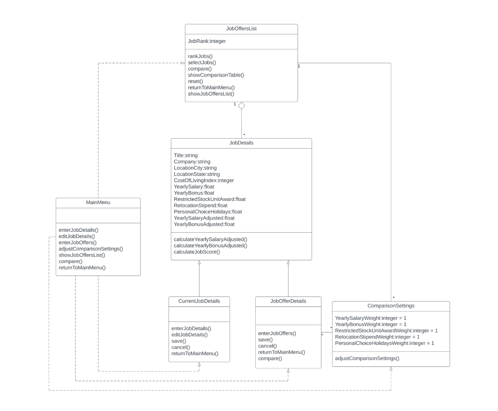
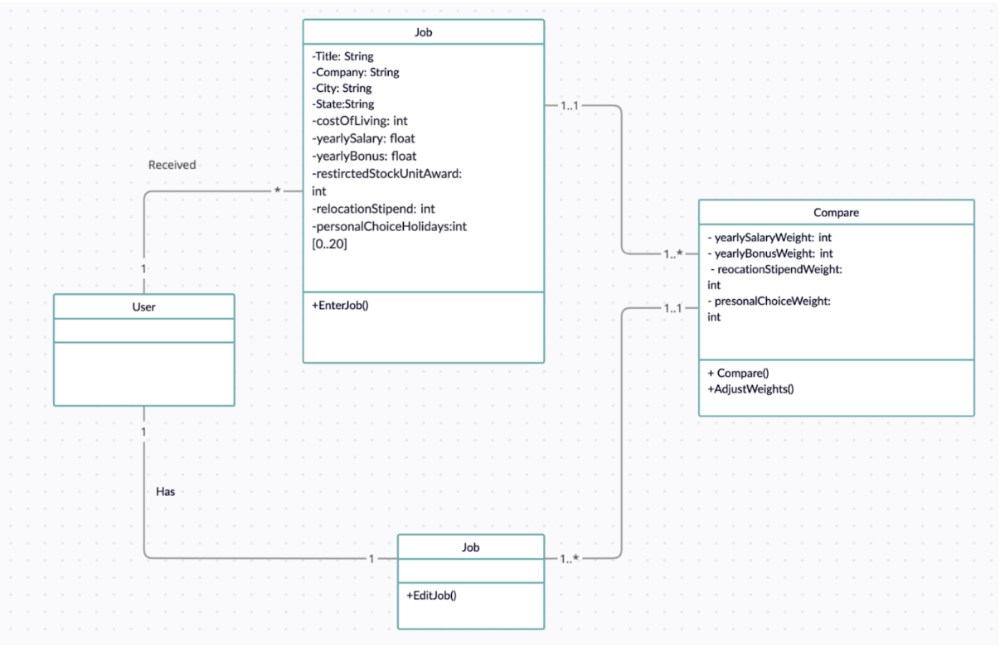
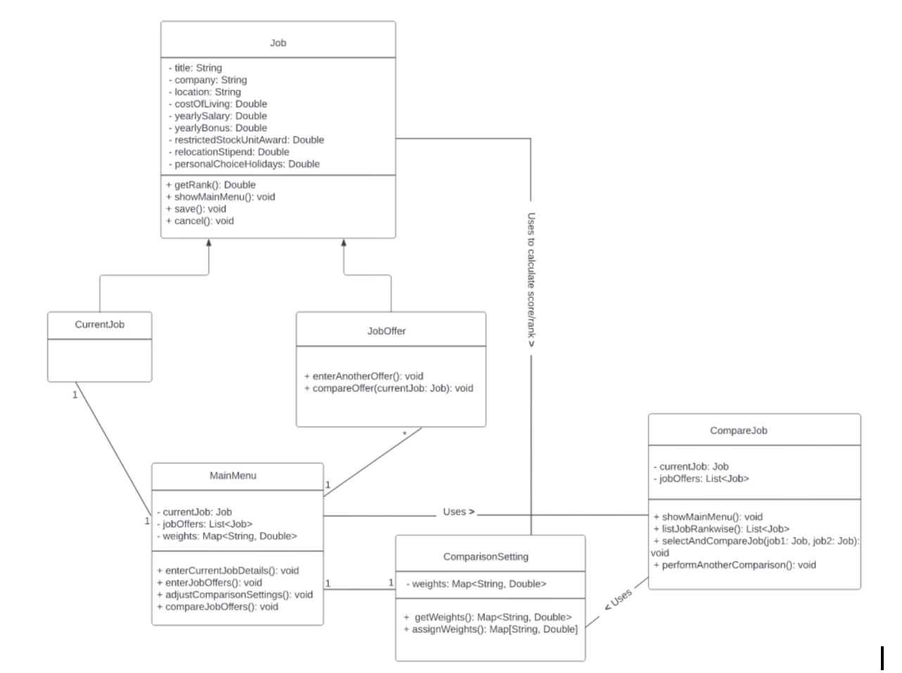
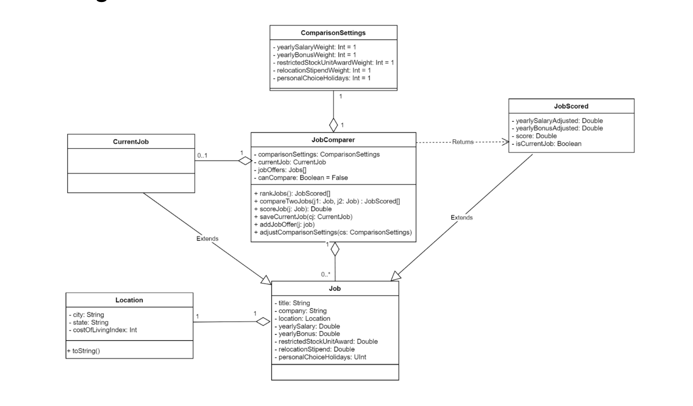
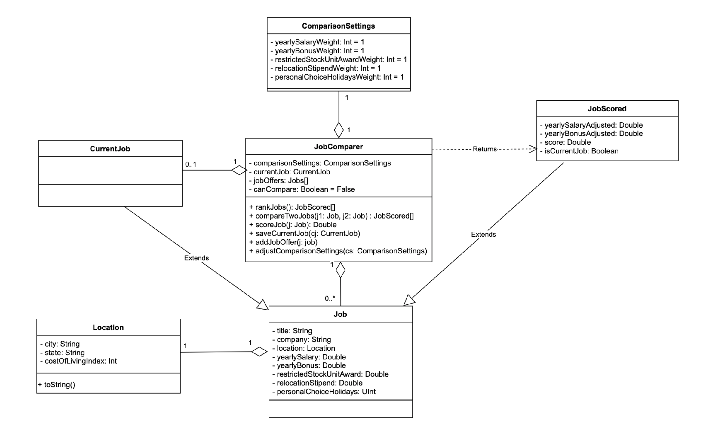

# Design 1

Following pros were discussed: 
- Presence of an entrypoint class (MainMenu class in this case)
- Job class should have calculateYearlySalaryAdjusted() and calculateYearlyBonusAdjusted() method
- Separate class for CurrentJob so that it is easily distinguished from JobOffer as CurrentJob is related via (0..1 to 1) relationship but JobOffer is related via (0..* to 1) relationship with entrypoint class.

Following cons were discussed:
- No need for the JobOfferList class, instead MainMenu should be directly associated with the JobOffer class using a 1..* relationship
- ComparisonSettings should probably be a singleton (not * to *)
- Missing parameters details on the methods
- Relationships between classes needs to be refined. For example, ComparisonSettings should probably be a singleton (not * to *)
- JobOfferDetails class can be removed and Main Menu can directly associate with JobDetails class via 0..1 to * relationship for JobOffers

 

# Design 2

We did not discuss much on this design as the common decision was that this design should be changed entirely as it has many points missing from the original requirement doc.

 

# Design 3

Following pros were discussed:
- Presence of an entrypoint class (MainMenu class in this case)
- Separate class for CurrentJob so that it is easily distinguished from JobOffer as CurrentJob is related via (0..1 to 1) relationship but JobOffer is related via (0..* to 1) relationship with entrypoint class.

Following cons were discussed:
- UI transitions modeled here (bad)
- No need for extra CompareJob class
- Job Offer class can be removed and MainMenu can directly associate with Job class via 0..1 to * relationship for JobOffers
- No separate fields for Location input
- Should be 0..1 to 1 between MainMenu and CurrentJob
- Should be 0..1 to * between MainMenu and JobOffer
- personalChoiceHolidays should be Integer (rather than Double)
- Weights are better represented as Integers rather than Double and this is a requirement in the assignment instructions
- BonusAdjusted and SalaryAdjusted missing
- Too many dependencies with ComparisonSettings class (3 classes)

 

# Design 4

Following pros were discussed:
- Separate Location class
- Current Job relationship should be 0..1 to 1
- Separate JobScored class with additional properties for yearly salary and bonus adjusted
- The MainMenu doesn't relate to a specific class to be modeled in the UML class diagram because it is tied to user interaction within the app. However, we will model the class JobComparer to be the main entry point of the application and will tie everything together
- Separate CurrentJob to associate JobComparer with CurrentJob via 0..1 to 1 relationship
- Associating Job with JobComparer via 0..* to 1 relationship to model multiple Job offers
- adjustComparisonSettings accepting parameters that updated comparisonSettings
- Covers all the requirements with properly defined relationships among classess

Following cons were discussed:
- personalChoiceHolidays in ComparisonSettings should be changed to personalChoiceHolidaysWeight

 

# Team Design

We have chosen the [Design 4](#design-4) as our team design after fixing the minor point mentioned in its Cons section. The pros discussed in the [Design 4](#design-4) section clarifies our final decision.

 

# Summary

The process turned out to be fruitful. All four members discussed all the designs thoroughly. Everyone got chance to discuss their opinion. We refined our understanding through discussion and explanation and finally came up with the final team design.
