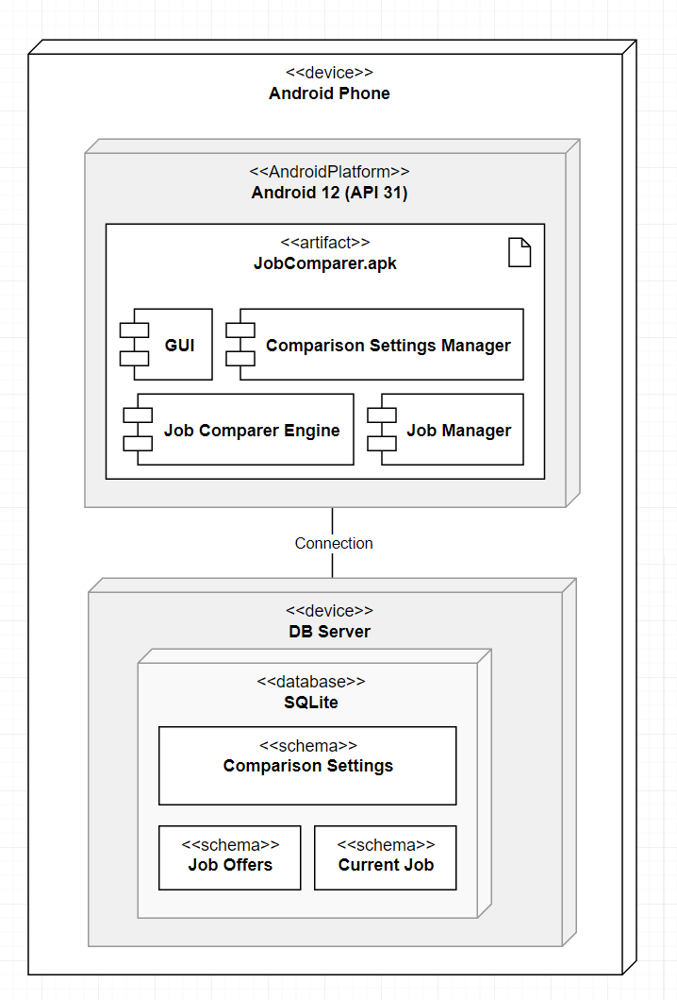

# Design Document

**Author**: Team 038

## 1 Design Considerations

### 1.1 Assumptions

- The app will be used on a device with Android Operating System
- The device will be used on an application with touch screen capability
- The user comprehends instructions and prompts in the English language
- The currency format is in US Dollar ($)
- The location format is in US address format (City, State)
- All information is available for current job and every job offer, therefore the app will not allow the user to leave any fields blank
- Cost of living index is an integer
- Weights inputted in Adjust Comparison Settings will be integers
- Personal choice holidays is an integer
- Clicking `Cancel` and `Return to Main Menu` buttons cancels the user's preceding action and returns the user to the Main Menu
- Within the `Enter Job Offers` page, once the user makes their selection of canceling their entry or saving their entry, the app will execute their request, and a screen will consequently show up to prompt the user to enter another job offer, return to main menu, or compare another job offer

### 1.2 Constraints

**User limitation:**

- The app will be designed for a single user

**Verification and validation requirements:**

- The app should be tested to a full suite of test cases

**Languages:**

- The application will only be supporting English language. No translations will be provided.

### 1.3 System Environment

**Hardware Requirements:**

- **Devices**: Android smartphones only
- **Processor**: Dual-core 1.2GHz or higher (smartphones released after 2012)
- **Memory**: 2 GB RAM or more
- **Display**: 1080 x 1920 (Full HD) or better
- **Sensors**: Touch screen

**Software Requirements:**

- **Operating System**: Android 12 (Snow Cone) or higher (API 31 or higher)
- **Database**: SQLite (for local storage),
- **Software**: A File Manager is required (to find and install the APK)

**Other Requirements:**

- **Network**: Internet connectivity for downloading the app (but is not required for using it)
- **Authorizations**: Allowing unknown apps to be installed on the device (App settings > Special Access > Install unknown apps)

## 2 Architectural Design

### 2.1 Component Diagram

**Android App:** The Android App is the user interface through which the user interacts with the system. It provides access to the main menu and the different functions of the system.

**Job Manager:** The Job Manager component manages the job data entered by the user, including the user's current job details and job offers. It also provides functionality to save and retrieve job data from the storage component.

**Comparison Settings Manager:** The Comparison Settings Manager component allows the user to adjust the comparison settings by assigning integer weights to each factor. This component interacts with Storage to save, retrieve and update Comparison Settings for various factors involved.

**Job Comparison Engine:** The Job Comparison Engine component performs the comparison of job offers based on the user's selected criteria. It takes the job data as input, applies the comparison settings, and outputs a ranked list of job offers. It also calculates the rank for each job based on the weights assigned to each criterion. It takes job data as input, applies the weighting formula, and outputs a score for each job. Based on these scores the comparison is performed.

**Storage:** The Storage component manages the persistent storage of job data. It provides functionality to save, retrieve, and delete job data from a database or file system.

### 2.2 Deployment Diagram

## 3 Low-Level Design

### 3.1 Class Diagram

## 4 User Interface Design

<table>
  <tr>
    <td>Enter/Edit Job Details Page 1 Part 1</td>
     <td>Enter/Edit Job Details Page 1 Part 2</td>
  </tr>
  <tr>
    <td></td>
    <td></td>
  </tr>
 </table>
 <table>
  <tr>
    <td>Enter Job Offers Page 1 Part 1</td>
    <td>Enter Job Offers Page 1 Part 2</td>
    <td>Enter Job Offers Page 2 </td>
  </tr>
  <tr>
    <td></td>
    <td></td>
    <td></td>
  </tr>
 </table>

 

 <table>
  <tr>
    <td>Enter/Compare Job Offers Inputs</td>
     <td>Enter/Compare Job Offers Ouput</td>
  </tr>
  <tr>
    <td></td>
    <td></td>
  </tr>
 </table>

*Note: The lgos presented in the UI mock-up are for demonstration purposes only. The deployed application will have the initials of the company names instead.* 
