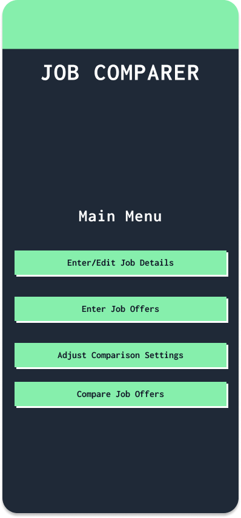
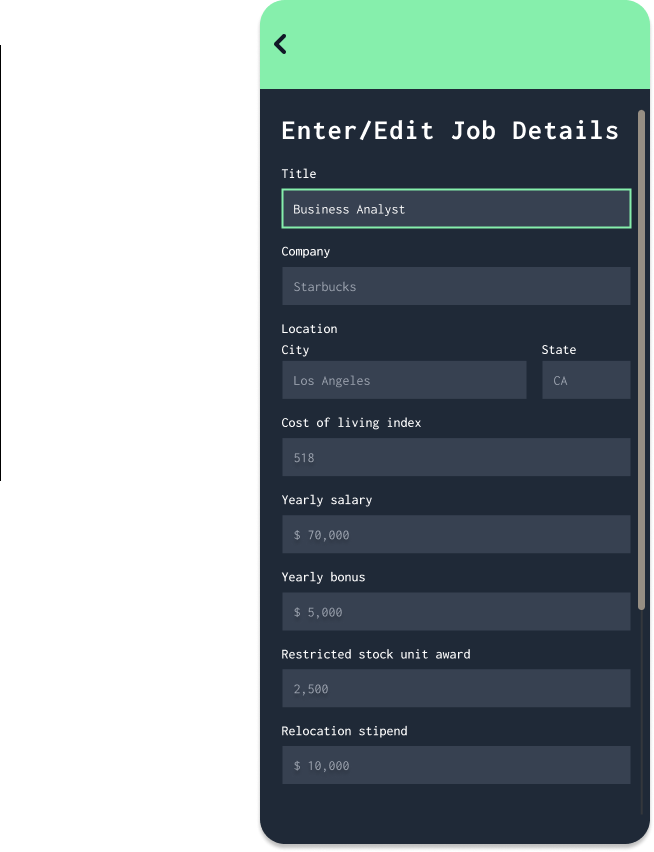
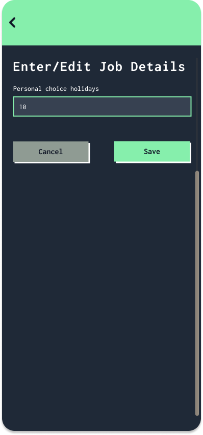
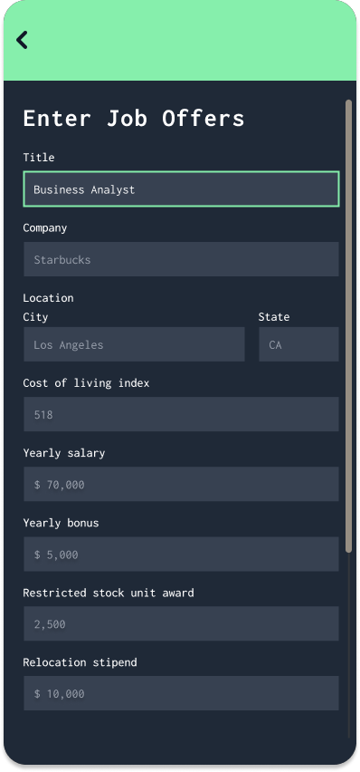
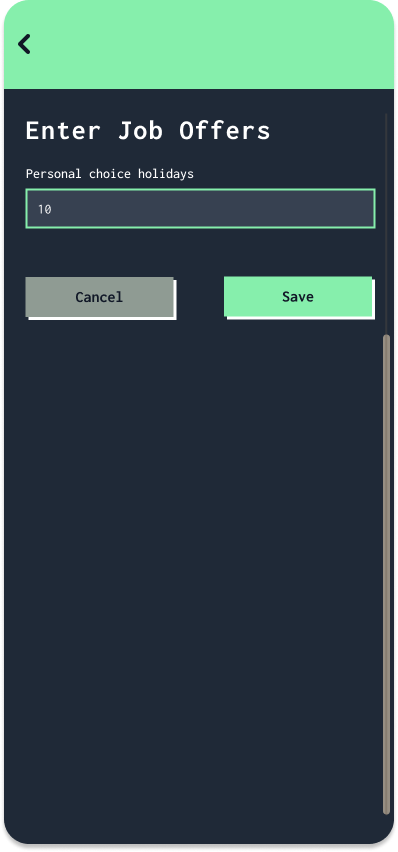
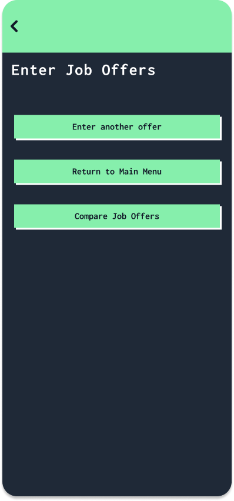
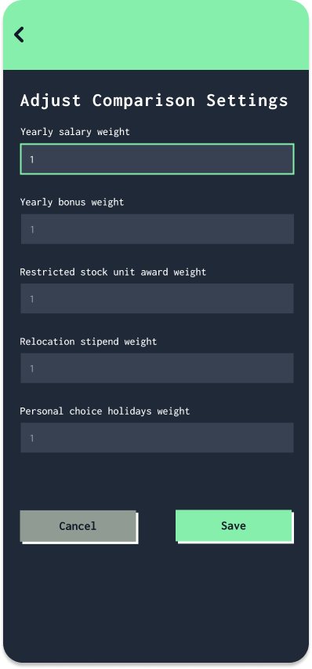
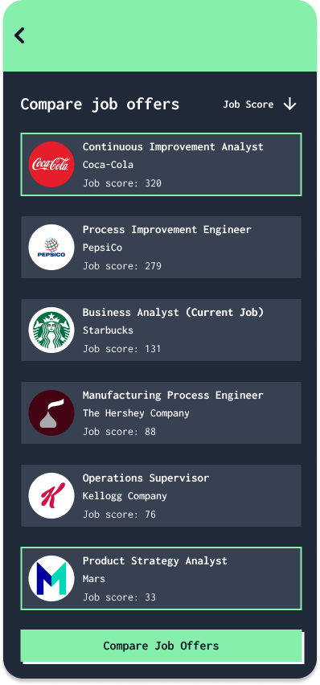
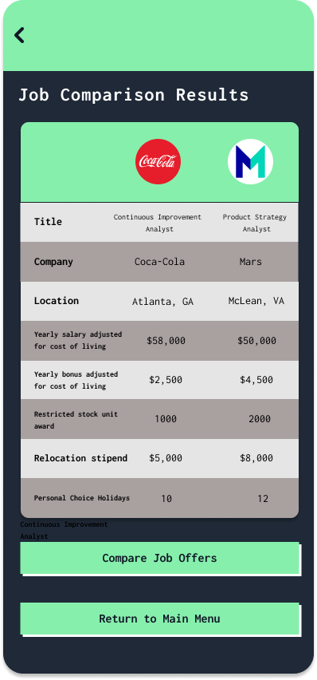

# Design Document

**Author**: Team 038

## 1 Design Considerations

### 1.1 Assumptions
> - The app will be used on a device with Android Operating System
> - The device will be used on an application with touch screen capability
> - The user comprehends instructions and prompts in the English language
> - The currency format is in US Dollar ($)
> - The location format is in US address format (City, State)
> - All information is available for current job and every job offer, therefore the app will not allow the user to leave any fields blank
> - Cost of living index is an integer
> - Weights inputted in Adjust Comparison Settings is an integer
> - Personal choice holidays is an integer
> - Clicking `Cancel` and `Return to Main Menu` buttons cancels the user's preceding action and returns the user to the Main Menu
> - Within the `Enter Job Offers` page, once the user makes their selection of canceling their entry or saving their entry, the app will execute their request, and a screen will consequently show up to prompt the user to enter another job offer, return to main menu, or compare another job offer 

### 1.2 Constraints

> User limitation:
> - The app will be designed for a single user
> 
> Verification and validation requirements:
> - The app should be tested to a full suite of test cases
>
> Language:
> - The application will only be written in the English language

### 1.3 System Environment
> - The app will  be developed using Android 3.X or higher
> - The application is only compatible to run on devices that run on Android Operating system
> - The app will be developed using Java 11 or higher; therefore, the hardware should be able to support Java 11
> - The Android device is running a minimum API level of API 31 or above 

## 2 Architectural Design

*The architecture provides the high-level design view of a system and provides a basis for more detailed design work. These subsections describe the top-level components of the system you are building and their relationships.*

### 2.1 Component Diagram

**Android App:** The Android App is the user interface through which the user interacts with the system. It provides access to the main menu and the different functions of the system.

**Job Manager:** The Job Manager component manages the job data entered by the user, including the user's current job details and job offers. It also provides functionality to save and retrieve job data from the storage component.

**Comparison Settings Manager:** The Comparison Settings Manager component allows the user to adjust the comparison settings by assigning integer weights to each factor. This component interacts with Storage to save, retrieve and update Comparisions settings for various factors involved.

**Job Comparison Engine:** The Job Comparison Engine component performs the comparison of job offers based on the user's selected criteria. It takes the job data as input, applies the comparison settings, and outputs a ranked list of job offers.

**Job Ranking Engine:** The Job Ranking Engine component calculates the score for each job based on the weights assigned to each criterion. It takes job data as input, applies the weighting formula, and outputs a score for each job.

**Storage:** The Storage component manages the persistent storage of job data. It provides functionality to save, retrieve, and delete job data from a database or file system.

### 2.2 Deployment Diagram

*This section should describe how the different components will be deployed on actual hardware devices. Similar to the previous subsection, this diagram may be unnecessary for simple systems; in these cases, simply state so and concisely state why.*

## 3 Low-Level Design

*Describe the low-level design for each of the system components identified in the previous section. For each component, you should provide details in the following UML diagrams to show its internal structure.*

### 3.1 Class Diagram

*In the case of an OO design, the internal structure of a software component would typically be expressed as a UML class diagram that represents the static class structure for the component and their relationships.*

### 3.2 Other Diagrams

*<u>Optionally</u>, you can decide to describe some dynamic aspects of your system using one or more behavioral diagrams, such as sequence and state diagrams.*

## 4 User Interface Design

<table>
  <tr>
    <td>Enter/Edit Job Details Page 1 Part 1</td>
     <td>Enter/Edit Job Details Page 1 Part 2</td>
  </tr>
  <tr>
    <td></td>
    <td></td>
  </tr>
 </table>
 
 
 <table>
  <tr>
    <td>Enter Job Offers Page 1 Part 1</td>
    <td>Enter Job Offers Page 1 Part 2</td>
    <td>Enter Job Offers Page 2 </td>
  </tr>
  <tr>
    <td></td>
    <td></td>
    <td></td>
  </tr>
 </table>
 
 
 
 
 
 <table>
  <tr>
    <td>Enter/Compare Job Offers Inputs</td>
     <td>Enter/Compare Job Offers Ouput</td>
  </tr>
  <tr>
    <td></td>
    <td></td>
  </tr>
 </table>
