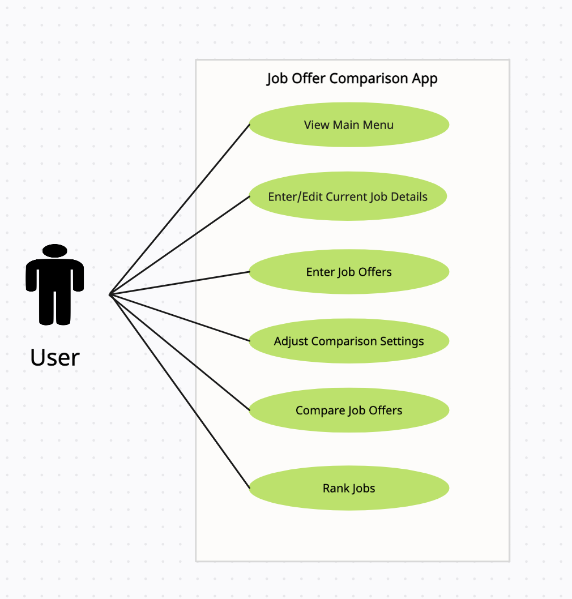

# Use Case Model

**Author**: rjain363

## Use Case Diagram

 

 

## Use Case Descriptions

### Use Case 1: View Main Menu

**Requirements:** When the app is started, the user is presented with the main menu, which allows the user to

1. Enter or edit current job details.
1. Enter job offers.
1. Adjust the comparison settings.
1. Compare job offers (disabled if no job offers were entered yet).

**Pre-conditions:** The app is installed and the user has launched it.

**Post-conditions:** The user is presented with the main menu.

**Scenarios:**

1. User launches the app.
1. The main menu is displayed, presenting the user with the four available options discussed under the requirements above.

 

### Use Case 2: Enter/Edit Current Job Details

**Requirements:** When choosing to enter current job details, a user will:

1. Be shown a user interface to enter (if it is the first time) or edit all the details of their current job, which consist of:
    - Title
    - Company
    - Location (entered as city and state)
    - Cost of living in the location (expressed as an index)
    - Yearly salary
    - Yearly bonus
    - Restricted Stock Unit Award (expressed as a lump sum vested over 4 years)
    - Relocation stipend (A single value from $0 to $25,000)
    - Personal Choice Holidays (A single overall number of days from 0 to 20)
1. Be able to either save the job details or cancel and exit without saving, returning in both cases to the main menu.

**Pre-conditions:** The user has selected the option to enter or edit current job details from the main menu.

**Post-conditions:** The user has either saved the current job details or canceled without saving and returned to the main menu.

**Scenarios:**

1. User selects the option to enter or edit current job details from the main menu.
1. The user interface for entering or editing current job details is displayed, pre-populated with existing details (if any).
1. User enters or edits the job details.
1. User chooses to save the job details or cancel and return to the main menu.

 

### Use Case 3: Enter Job Offers

**Requirements:** When choosing to enter job offers, a user will:

1. Be shown a user interface to enter all the details of the offer, which are the same ones listed above for the current job.
1. Be able to either save the job offer details or cancel.
1. Be able to
    - Enter another offer
    - Return to the main menu
    - Compare the offer (if they saved it) with the current job details (if present).

**Pre-conditions:** The user has selected the option to "Enter job offers" from the main menu.

**Post-conditions:** The user has either saved the job offer details and returned to the main menu, or canceled and returned to the main menu, or has comparison table pulled up with current job details if compare job option is selected and current job is present else return to main menu with error toast.

**Scenarios:**

1. User selects the option to enter job offers from the main menu.
1. The user interface for entering job offers is displayed.
1. User enters the job offer details.
1. User chooses to save the job offer details, cancel, or compare the offer with current job details (if present).
1. If user chooses to enter another offer, the user interface for entering job offers is displayed again, and steps 3-5 repeat until the user chooses to return to the main menu.

 

### Use Case 4: Adjust Comparison Settings

**Requirements:** Allow the user to assign integer weights to the comparison factors.

**Pre-conditions:** The user has selected the option to "Adjust Comparison Settings" from the main menu.

**Post-conditions:** The comparison settings have been updated with the new weights.

**Scenarios:**

1. The user selects the "Adjust Comparison Settings" option from the main menu.
1. The user is presented with a screen that displays the current weights for each comparison factor (yearly salary, yearly bonus, restricted stock unit award, relocation stipend, personal choice holidays).
1. The user can adjust the weights of each factor.
1. The user can save the new weights or cancel and discard the changes.
1. If the user saves the new weights, the comparison settings are updated with the new values, and the user is returned to the main menu.

 

### Use Case 5: Compare Job Offers

**Requirements:** Allow the user to compare two job offers (including current Job Detail).

**Pre-conditions:** Following are the pre-conditions:

1. The user has started the app.
1. At least two jobs (including Current Job) have been entered.
1. The user has selected the "Compare Job Offers" option from the main menu.
1. User is presented with the list of ranked Job offers including current Job.
1. User selects two of the Job offers out of the presented list.

**Post-conditions:**
1. The app presents a table comparing the job details of the two selected job offers
1. The user can choose to perform another comparison or return to the main menu.

**Scenarios:**

1. The user selects the "Compare Job Offers" option from the main menu.
1. The user is presented with a list of job offers that have been entered, along with the user's current job (if entered).
1. The user selects two job offers to compare.
1. The app computes a comparison score for each job offer, based on the weights assigned to the comparison factors.
1. The app displays a table that compares the two job offers, showing the following details for each job:
    - Title
    - Company
    - Location
    - Yearly salary adjusted for cost of living
    - Yearly bonus adjusted for cost of living
    - Restricted Stock Unit Award
    - Relocation stipend
    - Personal Choice Holidays
1. The user can choose to perform another comparison or return to the main menu.

 

### Use Case 6: Rank Jobs

**Requirements:** Rank job offers based on the comparison score. This use case is indirectly used by Compare Job Offers use case where the the list of ranked jobs are to be presented.

**Pre-conditions:** Following are the pre-conditions:

1. The user has started the app.
1. At least two jobs (including Current Job) have been entered.
1. The user has selected the "Compare Job Offers" option from the main menu.

**Post-conditions:** 

1. The job offers have been ranked based on the comparison score.
1. Table showing list of ranked job offers including current job appreas in the app.

**Scenarios:**

1. The user has entered two or more job offers.
1. The app computes a comparison score for each job offer, based on the weights assigned to the comparison factors.
1. The app ranks the job offers based on their comparison score, from highest to lowest.
1. The app displays the list of job offers, with each job offer showing its rank, title, and company.
